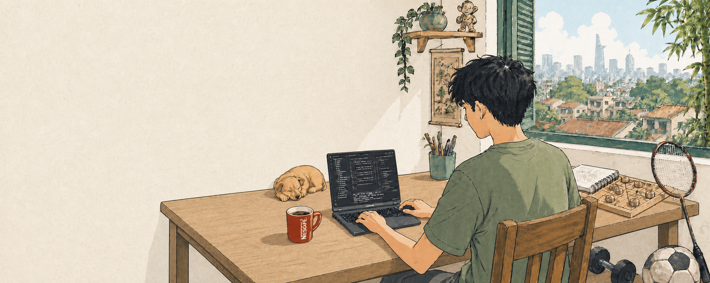

  <picture>
    <source srcset="./assets/bugslayer-banner.gif" type="image/gif" />
    
  </picture>

<h1 align="center">Đoàn Tấn Phong - Bugslayer</h1>

  <strong>Software Engineering student at HCMUS</strong>

  My dream is to become a Game Developer and create games inspired by Vietnamese history.

  Ho Chi Minh City, Vietnam
  

  <a href="mailto:24120408@student.hcmus.edu.vn">Email</a>
  ·
  <a href="https://github.com/doantanphong-hcmus?tab=repositories">Projects</a>

---

### Hey, I'm Phong 👋

I'm a third-year Software Engineering student at the **University of Science, VNU-HCM (HCMUS)**, currently making my way toward game development.

I take my work seriously, but not myself. With me, bugs are less like enemies and more like unexpected side quests.

> **My long game:** to create a game where Vietnamese history is not merely a chapter to memorize, but a living world people can step into, struggle through, and remember.

### Current quest 🧭

- Strengthening my **C++** and game-programming foundations
- Learning to turn mechanics, systems, and stories into meaningful player experiences
- Carrying what I learned from AI, data, testing, and full-stack products into game development
- Looking for good problems, honest feedback, and people who enjoy building things with care

### Things I've built

<table>
  <tr>
    <td width="50%" valign="top">
      <h3 align="center"><a href="https://github.com/doantanphong-hcmus/WikiStock">WikiStock</a></h3>
      

        
      

      
An evidence-grounded knowledge platform for Vietnamese public companies, combining structured financial data with OCR, RAG, vector search, and source-level citations.

      
<strong>My role:</strong> Data Scientist / ML Engineer

      
Python · FastAPI · BGE-M3 · PostgreSQL · pgvector · Next.js · NestJS

    </td>
    <td width="50%" valign="top">
      <h3 align="center"><a href="https://github.com/doantanphong-hcmus/C-reer_POWORK">POWORK</a></h3>
      

        
      

      
An anonymous hiring platform that evaluates real work before revealing identity, with rubric-based assessment, AI moderation, verification, and carefully tested access rules.

      
<strong>My role:</strong> Tech Lead / QA

      
TypeScript · Next.js · Node.js · Express · Prisma · PostgreSQL · Docker

    </td>
  </tr>
</table>

### Toolbox

<strong>Languages</strong>

  
  
  
  
  

<strong>Frameworks & runtime</strong>

  
  
  
  
  
  

<strong>Data, AI & tools</strong>

  
  
  
  
  
  
  

These are tools I have used while shipping projects—not a Pokédex I am trying to complete

### Away from the keyboard

You will probably find me playing **xiangqi**, on a **badminton** court, at the **gym**, or watching **football**. A little competition keeps the mind sharp; a little movement keeps the debugger sane.

---

  <em>Where there's a will, there's a way.</em>

